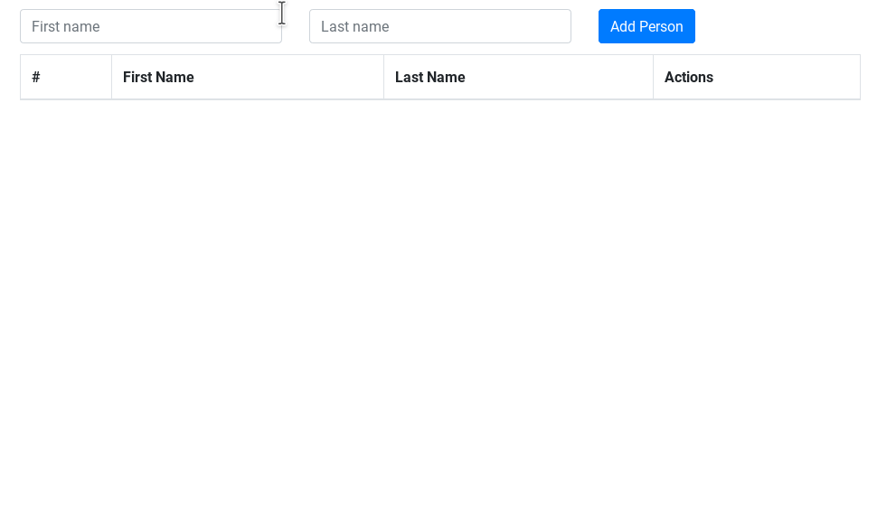

# Django React CRUD REST App

Prototype app made for learning purposes



## Install

```bash
cd backend/
pip install -r requirements.txt
python manage makemigrations
python manage migrate
python manage runserver
```

```bash
cd frontend/
npm install
npm start
```
